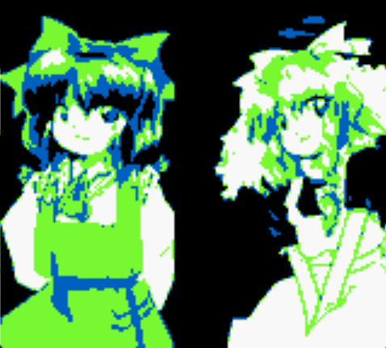
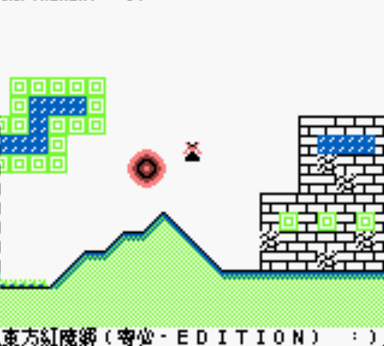

# TouhouGBA～東方寄必诶

## What is this?～这是啥？
This is a place where I attempt to learn making GB and GBA games and ultimately create a Touhou GBA fangame.

以制作东方同人游戏为目标尝试学习 GB 和 GBA 游戏开发的代码。

## Contents～内容
|Directory 目录|Purpose 目的|Status 状态|
|-------|-------|-------|
|gb/game|Gameboy ROM Gameboy 游戏|Not started 未开始|
|gb/learn|Learn GB development 学习 Gameboy 开发的代码|Testing 测试中|
|gb/resources|Common recources including libraries and emulators 库与模拟器等常用资源|Included 已添加|
|gba/game|Gameboy Advance ROM GBA 游戏|Not Started 未开始|
|gba/learn|Learn GBA development 学习 GBA 开发的代码|Not started 未开始|
|img|screenshots 截图|*Unimportant* *不重要*|

## Progress～进度
- GB (Learning) Gameboy 学习
  1. Hello World √ 初始 √
  2. Sprite Test √ 贴图测试 √
  3. Moving Test √ 移动测试 √
  4. Background Test √ 背景测试 √
  5. Sound Test √ 声音测试 √
  6. Window Layout Test √ 窗体测试 √
  7. Noise Test √ 噪声测试 √
  8. Jumping Test √ 跳跃测试 √
  9. Metasprite Test √ 复合贴图测试 √
  10. Sprite Collision Test √ 贴图碰撞测试 √
  11. Background Collision Test √ 背景碰撞测试 √
  12. Splashscreen Test √ 启动界面测试 √
  13. Fade Effect Test √ 淡入淡出测试 √
  - To Be Continued... 少女折寿中...
- GB (Game) Gameboy 游戏
- GBA (Learning) GBA 学习
- GBA (Game) GBA 游戏
## Screenshot～截图

## Characters～自機紹介
|Features 特性|Hakurei Reimu 博麗霊夢|Kirisame Marisa 霧雨魔理沙|
|--------|-------------|---------------|
|Abililty 能力|Unaffected by gravity 在天空飞行程度的能力|Using magic 使用魔法程度的能力|
|Effect 效果|Moving speed is uniform in all 4 directions, does not fall down even when not actively flying 四方向移动速度相同，不会从空中掉落|Falls down slowly if not actively flying, but can accelerate upwards / downwards significantly faster 不主动飞行时会从空中缓缓掉落，但上/下加速很快|
|Bomb 符卡|Spirit sign "Dream Seal" 霊符「夢想封印」|Love sign "Master Spark" 恋符「マスタースパーク」|